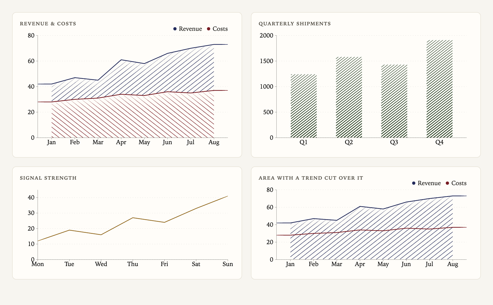
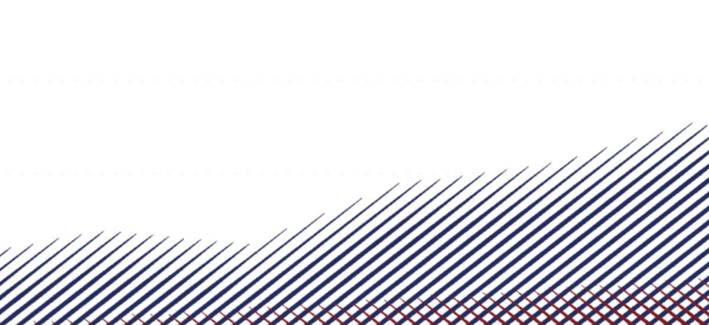

<div align="center">
  <h1>engrave-kit</h1>

  <p>
    <a href="https://jgalea.github.io/engrave-kit/"></a>
    <a href="LICENSE"></a>
    <a href="https://rebelcode.com"></a>
  </p>

  <p><strong>Charts drawn the way a copperplate engraver would draw them: no grey ink, tone built entirely from swelled hatch lines.</strong></p>

  
</div>

## What this is

A small React chart library that renders on canvas. Every area, bar and band is built from engraved line work instead of solid colour: an area is a swelling contour cut over sparse hatched ground, and bars fill with the same hatch.

A copperplate engraver has no grey ink. Tone comes from line work: lines cut closer together, and cut deeper. A deeper cut holds more ink and prints wider, so a single continuous line swells and tapers as it crosses light and dark passages. That swell is the tell. It's what your eye reads as "engraving" rather than "drawing".

Zoom in and you can see it. The top edge is cut as one swelling line, a hairline where the shape is shallow and thickening as it climbs, sitting over a sparse hatch that gives the fill its tone. Nothing here is a texture or an overlay: the tone *is* the line work.



Which is also why the existing hand-drawn chart libraries can't get here. [rough.js](https://github.com/rough-stuff/rough) and everything built on it (chart.xkcd, roughViz) are deliberately *wobbly*: roughness and bowing are the point, and wobble reads as pencil. engrave-kit's lines are dead straight and perfectly parallel. Only their width moves.

Live demo: **[jgalea.github.io/engrave-kit](https://jgalea.github.io/engrave-kit/)**

## Install

engrave-kit ships as source through a [shadcn registry](https://ui.shadcn.com/docs/registry), so the components land in your repo and you own them. There is no runtime package to depend on.

Register the namespace once in `components.json`:

```json
{
  "registries": {
    "@engrave-kit": "https://raw.githubusercontent.com/jgalea/engrave-kit/main/r/{name}.json"
  }
}
```

Then add what you need:

```bash
npx shadcn@latest add @engrave-kit/area-chart
npx shadcn@latest add @engrave-kit/bar-chart
npx shadcn@latest add @engrave-kit/engrave-kit   # everything
```

## Use

The API is children-as-config, so it reads like recharts:

```tsx
import { AreaChart, Area, XAxis, YAxis, Grid, Tooltip, Legend } from "@/components/engrave-kit"

const config = {
  wpmayor: { label: "WP Mayor", color: "crimson" },
  spotlight: { label: "Spotlight", color: "indigo" },
}

<AreaChart data={rows} config={config}>
  <Grid />
  <XAxis dataKey="date" />
  <YAxis />
  <Tooltip labelKey="date" />
  <Legend />
  <Area dataKey="wpmayor" />
  <Area dataKey="spotlight" />
</AreaChart>
```

Series hatch at alternating angles (-38°, +38°, then cross-hatch), so overlapping fills stay separable in the way engravers kept adjacent objects legible in a single ink.

Bars and lines take the same shape:

```tsx
<BarChart data={quarters} config={{ units: { label: "Units", color: "moss" } }}>
  <Grid />
  <XAxis dataKey="quarter" />
  <YAxis />
  <Bar dataKey="units" />
</BarChart>

<LineChart data={days} config={{ signal: { label: "Signal", color: "ochre" } }}>
  <Line dataKey="signal" />
</LineChart>
```

Stack an area chart by passing `stackType="stacked"` to the root.

Colours come from a closed set of named inks rather than arbitrary hex, the way a print shop stocks a drawer rather than mixing to order: `ink`, `crimson`, `indigo`, `moss`, `ochre`, `slate`.

## The one file that matters

`engrave-paint.ts` is the burin. Everything else is scaffolding around it. If you want to understand or fork this library, read that file first: it lays straight hatch lines across whatever region you've clipped, and modulates each line's width by a tone function you supply. The chart components just decide what to clip and what tone means.

That also means it isn't really chart-specific. Point it at any clip region and any `ToneFn` and it will engrave that.

## Credits

The idea of treating a chart's fill as a print process, rather than a colour, is [Evil Charts](https://github.com/legions-developer/evilcharts)' — worth a look, and worth a star.

## License

MIT
